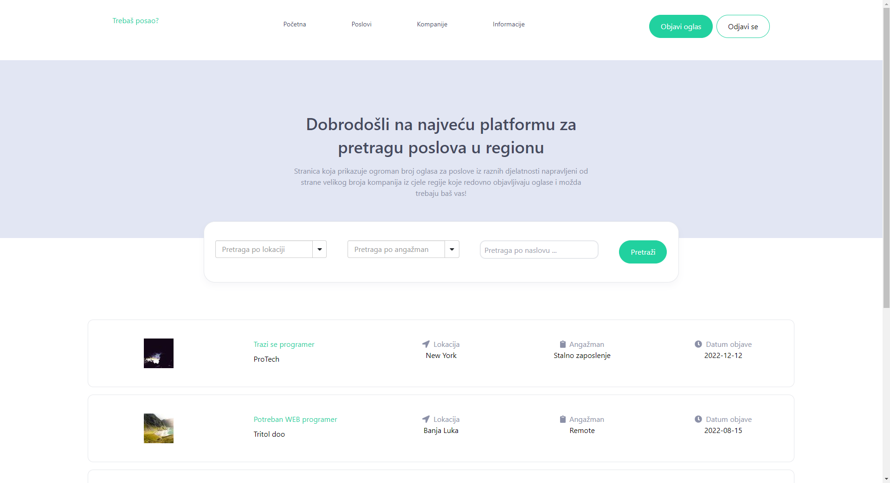

# Job board web app

Job board web app made with ReactJS, TailwindCSS and JAVA. Hosted using Tomcat web server and MySQL as DBMS.

## Colors

[Colors](https://coolors.co/d8ddef-a0a4b8-7293a0-45b69c-21d19f)

## USE

Using CLI:

1. create docker network `docker network create job-board-net`

2. pull images:
    1. `docker pull blagoja95/job-board-mysql-image:v1.0.1`
    2. `docker pull blagoja95/job-board-tomcat-image:v1.1.0`
    3. `docker pull blagoja95/job-board-node-image:v1.1.0`

3. create containers:
    1. `docker run -d -p 3306:3306 --name job-board-mysql --net job-board-net -e MYSQL_ROOT_PASSWORD=mydbpassword blagoja95/job-board-mysql-image:v1.0.1`
    2. `docker run --name job-board-tomcat -d -p 8080:8080 --net job-board-net blagoja95/job-board-tomcat-image:v1.1.0`
    3. `docker run -dp 3000:3000 --name job-board-node blagoja95/job-board-node-image:v1.1.0`

5. In browser search `localhost:3000`

Welcome to the landing page



## API [^1]

### GET

`/users`
get all users

```powershell
curl localhost:8080/users
```

`/users` with parameters can be used to find specific user

Parameters: *id*, *username*, *name*, *email* and *city*.

```powershell

curl localhost:8080/users?name=GuitarPro%20s.p. GET user GuitarPro

curl localhost:8080/users?email=support@protech.com GET user Langolo

curl localhost:8080/users?city=Banja%20Luka GET users from Banja Luka(encode url!)
```

Response JSON:

```JSON
{
  "results": 1,
  "users": [
    {
      "city": "Banja Luka",
      "name": "GuitarPro",
      "about": "Prodajemo gitare!",
      "id": 1881,
      "email": "info@guitarpro.com",
      "username": "guitar22"
    }
  ]
}
```

`/posts`
get all posts

```powershell

curl localhost:8080/posts
```

Parameters: *id*, *title*, *city*, *type* and *companyID*.

```powershell

curl localhost:8080/posts?city=Banja%20Luka GET posts from Banja Luka(encode url!)
```

```JSON
{
  "results": 2,
  "posts": [
    {
      "date": "2022-08-15",
      "companyID": "1123",
      "city": "Banja Luka",
      "companyName": "Tritol doo",
      "about": "InterPO je u potrazi za strucnim i motivisanim web programerom koji ce se pridruziti na?em timu. Kao web programer u InterPO-u, vasa uloga bice da radite na razvoju i odr?avanju visokokvalitetnih web aplikacija za nase klijente. Va?e zaduzenje ?e obuhvatiti pisanje cistog i efikasnog koda, razumevanje potreba klijenata i kreiranje funkcionalnih i skalabilnih web resenja.",
      "qual": "Trazimo osobu koja poseduje iskustvo u programiranju na front-end i\/ili back-endu i koja poznaje razlicite tehnologije kao sto su HTML, CSS, JavaScript, PHP i MySQL. Takodje, vazno nam je da imate iskustvo u radu sa razlicitim razvojnim alatima i okvirima kao sto su React, Angular, Vue.js, Laravel, Symfony i slicno.",
      "id": 12301,
      "title": "Potreban WEB programer",
      "type": "Remote"
    },
    {
      "date": "2023-04-29",
      "companyID": "1149",
      "city": "Banja Luka",
      "companyName": "BestTri",
      "about": " ...",
      "qual": "- dobro poznavanje rada sa Adobe Ilustratorom i Photoshop-om,\n- osnovno poznavanje rada sa ostalim Adobe alatima\n",
      "id": 5848,
      "title": "Trazi se Graficki dizajner",
      "type": "Remote"
    }
  ]
}
```

If no user or posts are found, users or posts property with empty array is returned.

```powershell
curl localhost:8080/users?name=notAnUser
```

#### Error response specific for GET method

```JSON
{
  "results": 0,
  "users": []
}
```

If using incorrect request following response is returned:

```JSON
{
  "results": 0,
  "info": "Wrong request!"
}
```

### Response status

The status property can be `0` or `1`. Use this as a binary confirmation of a request success.

The Second property is `info` which contains a server response messege.

### Login and registration of users

Login and registration returns three cookies:

`username`, `userID`, and session cookie `JSESSIONID`

EXAMPLES:

    username=user1;
    userid=1022;
    JSESSIONID=2962F2F1428377B13A22AC8CDC58E57F;

#### Register [^2]

calling /register via POST method is used to create a new user

```powershell
curl -X POST -v -d "name=MojaKompanija&username=mycomp11&city=Derventa&email=info@mycomp.com&about=empty&password=123456789" localhost:8080/register
```[^3]
```

If successful this JSON is returned:

```JSON
{
  "register": {
    "success": [
      "mycomp11",
      604
    ],
    "status": 1
  }
}
```

New session is created for newly created user

#### Login [^2]

calling /login via POST is used for login authentication

```powershell
curl -X POST -v -d "username=tritol22&password=123456789" localhost:8080/login
```

```JSON
{
  "login": {
    "success": [
      "tritol22",
      1123
    ],
    "status": 1
  }
}
```

New session is created for logged user

#### Logout

call /logout to invalidate session

```powershell
curl -X POST -v -b "JSESSIONID=947E1129779927408BCDAF885B462C2D" localhost:8080/logout
```

```json
{
  "logout": {
    "status": 1,
    "info": "Successfully logout"
  }
}
```

##### Error response specific for login and registration

###### No user

On login if no user is found following JSON response is returned

```JSON
{
  "login": {
    "status": 0,
    "info": "There is no user with provided credentials!"
  }
}
```

###### Incorrect password

If password is wrong following JSON response is returned

```JSON
{
  "login": {
    "status": 0,
    "info": "Incorrect password!"
  }
}
```

### Create post

Create network request using POST method. **MUST BE LOGGED IN**

Requested parameters: *companyID*, *companyName*, *title*, *type*, *city*, *about* and *qual*

```powershell
curl -X POST -b "JSESSIONID=947E1129779927408BCDAF885B462C2D" -b "userID=641" -d "companyID=641&companyName=Tritol DOO&title=Test title&type=full time&ci
ty=Trebinje&about=Loking for&qual=Java" localhost:8080/posts
```

If successful response JSON with new post ID will return with success status

```JSON
{
  "posts": {
    "id": 8717,
    "status": 1
  }
}
```

### Delete [^3]

Create network request using DELETE method. **MUST BE LOGGED IN**

Request parameter is *id* of the desired post or user for delete.

Also require userID cookie.

#### Post

```powershell
curl -X DELETE -b "JSESSIONID=B0F4A3D4373564E825050EEFB9E6999B" -b "userID=641" localhost:8080/posts?id=8063
```

#### User

This feature curently is missing! Will be addresed in
issue <a href="https://github.com/Blagoja95/job-board-web-app/issues/63">63</a>.

#### Response

If successful response JSON with number that is greater than zero (rows affected) is return.

```JSON
{
  "posts": {
    "status": 1,
    "info": "Post successfully deleted!"
  }
}
```

If unsuccessful then zero is return

```JSON
{
  "posts": {
    "status": 0,
    "info": "Error, check post ID!"
  }
}
```

#### Errors

##### Current user does not have rights to delete post

A user with a userID=1 wants to delete post with a id postID=100 which is post from a user userID=2. This is not
allowed.

```powershell
curl -X DELETE -b "JSESSIONID=947E1129779927408BCDAF885B462C2D" -b "userID=1" localhost:8080/posts?id=100
```

```json
{
  "posts": {
    "status": 0,
    "info": "Delete action denied!"
  }
}
```

### Update

Send POST request on `/users/update` or `/posts/update`. **MUST BE LOGGED IN**

#### User

Paramaters that can be updated[^4]: *name*, *email*, *about* and *city*

```powershell
curl -X POST -d "name=NEW NAME&email=new@new.com&about=...&city=NEW CITY" -b "JSESSIONID=947E1129779927408BCDAF885B462C2D" -b "userID=1123" localhost:8080/users/update
```

Response JSON:

```JSON
{
  "update": {
    "id": 1123,
    "status": 1,
    "info": "User profile is successfully updated!"
  }
}
```

Let us check result of an update

```powershell
curl localhost:8080/users?id=1123
```

Before:

```JSON
{
  "results": 1,
  "users": [
    {
      "city": "Banja Luka",
      "name": "Tritol doo",
      "about": "Tritol kompanija Banja Luka",
      "id": 1123,
      "email": "email@tritol.me",
      "username": "tritol22"
    }
  ]
}
```

After update:

```JSON
{
  "results": 1,
  "users": [
    {
      "city": "NEW CITY",
      "name": "NEW NAME",
      "about": "...",
      "id": 1123,
      "email": "new@new.com",
      "username": "tritol22"
    }
  ]
}
```

#### Post

Parameters that can be updated[^5]: *title*, *type*, *about*, *city* and *qual* (qualification).

```powershell
 curl -X POST -d "id=10000&title=NEW TITLE&type=NEW TYPE&city=Laktasi&about=...&qual=..." -b "JSESSIONID=947E1129779927408BCDAF885B462C2D" localhost:8080/posts/update
```

Response JSON:

```JSON
{
  "update": {
    "id": 10000,
    "status": 1,
    "info": "Post is successfully updated!"
  }
}
```

Status property can be `0` or `1`. Use this as a binary confirmation of a request success.

Let us check result of an update

```powershell
curl localhost:8080/posts?id=10000
```

Before

```JSON
{
  "results": 1,
  "posts": [
    {
      "date": "2022-12-12",
      "companyID": "293",
      "city": "Laktasi",
      "companyName": "Longolo",
      "about": "Trazi se programer sa 2 godine iskustva u java i java script tehnologijama",
      "qual": "srednja strucna sprema",
      "id": 10000,
      "title": "Trazi se programer",
      "type": "Stalno zaposlenje"
    }
  ]
}
```

After update

```JSON
{
  "results": 1,
  "posts": [
    {
      "date": "2022-12-12",
      "companyID": "293",
      "city": "Laktasi",
      "companyName": "Longolo",
      "about": "...",
      "qual": "...",
      "id": 10000,
      "title": "NEW TITLE",
      "type": "NEW TYPE"
    }
  ]
}
```

#### Errors

Only owners (and maybe admins issue <a href="https://github.com/Blagoja95/job-board-web-app/issues/63">63</a>) can
update posts.

```powershell
curl -X POST -d "id=10000&title=NEW TITLE 222&type=NEW TYPE&city=Laktasi&about=...&qual=..." -b "JSESSIONID=E6FA2AABB9D7733C1E6A0841A9265D65" -b "userID=641" localhost:8080/posts/update
```

```json
{
  "update": {
    "status": 0,
    "info": "Update action denied!"
  }
}
```

### Handling incorrect requests

Wrong or incorrect requests are handled, and proper response is return in JSON format. These are common responses for
all POST requests (Register, Login, Update and Creation of users and posts).

#### No parameters

When request is sent without parameters

```powershell
curl -X POST localhost:8080/login

// or

curl -X POST localhost:8080/register

```

error JSON response is returned

```JSON
{
  "login": {
    "status": 0,
    "info": "No parameters provided!"
  }
}
```

or

```json
{
  "register": {
    "status": 0,
    "info": "No parameters provided!"
  }
}
```

#### Empty parameters value

If any of parameters is empty string

```powershell
curl localhost:8080/users?name=Boris&email
```

Error JSON response is returned

```JSON
{
  "users": {
    "status": 0,
    "info": "Email is empty!"
  }
}
```

Other examples of JSON formatted response

```json
{
  "register": {
    "status": 0,
    "info": "About is empty!"
  }
}
```

or

```json
{
  "update": {
    "status": 0,
    "info": "Title is empty!"
  }
}

```

#### Missing required parameter

If one or more parameters that is required is missing error JSON response is returned.

Following request is missing `companyID` parameter and its value:

```powershell
curl -X POST -b "JSESSIONID=368103A3BCBEBA58D9947BF0E4A0EFBD" -d "companyName=Tritol DOO&title=Test title&type=full time&&city=Trebinje&about=Loking for&ual=Java" localhost:8080/posts
```

To create a new post [these](###Create-post) parameters are required.

```JSON
{
  "update": {
    "status": 0,
    "info": "Some required parameters are missing! Please check documentation!"
  }
}
```

#### Not existing ID

When updating users or posts, or when creating new post and using incorrect (none existing ID [^4]) following response
is returned:

Update of post and user with none existing IDs:

```JSON
{
  "update": {
    "status": 0,
    "info": "Post with id 1001 does not exist!"
  }
}

{
  "update": {
    "status": 0,
    "info": "User with id 1302 does not exist!"
  }
}
```

Example of network request where `companyID` (1003) does not exist:

```powershell
curl -X POST -b "JSESSIONID=368103A3BCBEBA58D9947BF0E4A0EFBD" -d "companyID=1003&companyName=Tritol DOO&title=Test title&type=full time&city=Trebinje&about=Loking for&qual=Java" localhost:8080/posts
```

```JSON
{
  "posts": {
    "status": 0,
    "info": "Company with id 1003 does not exist!"
  }
}
```

The following are Session errors:

#### Missing cookie

Trying to create, delete or update w/o being singed in or sending network request w/o required cookies will return error
json.

```json
{
  "posts": {
    "status": 0,
    "info": "Missing Cookie!"
  }
}
```

###### No session

```powershell
curl -X POST -v -b "JSESSIONID=123" localhost:8080/logout
```

```json
{
  "logout": {
    "status": 0,
    "info": "You must first be logged in!"
  }
}
```

###### Missing UserID cookie

```powershell
curl -X DELETE -b "JSESSIONID=2D26293A42268F6E3AEEBF0F406FB83B" localhost:8080/posts?id=1
```

```json
{
  "posts": {
    "status": 0,
    "info": "UserID cookie is missing!"
  }
}
```

###### Post ID parameter missing

```powershell
curl -X DELETE -b "JSESSIONID=947E1129779927408BCDAF885B462C2D" localhost:8080/posts?wrong=213
```

```json
{
  "posts": {
    "status": 0,
    "info": "PostID parameter is missing!"
  }
}
```

###### Post with ID=`value` not found

```powershell
curl -X DELETE -b "JSESSIONID=947E1129779927408BCDAF885B462C2D" -b "userID=641" localhost:8080/posts?id=1
```

```json
{
  "posts": {
    "status": 0,
    "info": "Post with ID 1 is not found!"
  }
}
```

[^1]: **Examples are run locally for now!!!**

[^2]: **Currently unsafe!** this issue will be addressed
in [#42](https://github.com/Blagoja95/job-board-web-app/issues/42)

[^3]: **cURL** If using curl to test API use -v flag to get response header printed out. Then you can copy cookies and
send them back (-b flag) when creating, deleting or updating data.

[^4]: **PRONE TO CHANGE** What can be updated and how it will be updated will probably be changed in future

[^5]: **IDs** must exist when they are used for update or creation. New Posts use existing `companyID`, update use
corresponding IDs for post and user row.

### Documentation

If you found documentation or software errors please feel free to [contact me](mailto:boris.blagojevicc@hotmail.com) or
raise an [issue](https://github.com/Blagoja95/job-board-web-app/issues).
